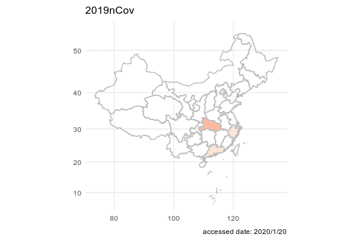

# Results

## Epidemic map

```{r setup, include=FALSE}
knitr::opts_chunk$set(echo = TRUE)
```

We first want to have a big picture on the spread of Cvod-19 in China. We decided to get an animation on the total confirmed cases of Cvod-19 for each province such that we may find a geometric pattern on the pandemic.

```{r, echo=TRUE}
df <- read.table("confirmed_final.csv", sep=",", header=TRUE)
head(df)
```

In order to ingregate the data with the map of China, we use chinamap made by GuangchangYu (https://github.com/GuangchuangYu/chinamap). And we apply package magick to make an animation of the spread of the virus.

```{r, echo=TRUE, message = FALSE, warning = FALSE, results = FALSE}
#require(nCov2019)
require(chinamap)
require(ggplot2)
library(magick)

cn = get_map_china()
cn$province = sub("省", "", cn$province)
cn$province = sub("自治区", "", cn$province)
cn$province = sub("市", "", cn$province)
cn$province = sub("特别行政区", "", cn$province)
cn$province = sub("维吾尔", "", cn$province)
cn$province = sub("壮族", "", cn$province)
cn$province = sub("回族", "", cn$province)

# china <- df %>%
#   dplyr::filter(date == "2020/2/1" & type == "confirmed_cases")
# df1 = data.frame(name = china$province_n,
#                 confirm = cut(china$value, c(1,10,100,500,1000,10000),
#                               include.lowest = T, right=F))
# 
# cn2 = merge(cn, df1, by.x='province', by.y='name', all.x=TRUE)
# cn2 = cn2[order(cn2$order),]
# p<-ggplot() +
#   geom_map(aes(long, lat, map_id=id, group=group, fill=confirm), map=cn2, data=cn2, colour='grey') +
#   coord_map() +
#   scale_fill_manual(values=cols, breaks=names(cols)) +
#   theme_minimal() +
#   xlab(NULL) + ylab(NULL) +
#   labs(title = '2019nCov',
#        caption=paste("accessed date:", "2020/2/1"))

d <- c(paste0("2020/1/", 20:31), paste0("2020/2/", 1:21))

img <- image_graph(600, 400, res = 96)

out <- lapply(d, function(date1){
  china <- df %>%
    dplyr::filter(date == date1 & type == "confirmed_cases")
  df1 = data.frame(name = china$province_n,
                confirm = cut(china$value, c(1,10,100,500,1000,10000,100000),
                              include.lowest = T, right=F))

  cn2 = merge(cn, df1, by.x='province', by.y='name', all.x=TRUE)
  cn2 = cn2[order(cn2$order),]
  cols = RColorBrewer::brewer.pal(6, 'Reds')
  names(cols) = levels(df$confirm)
  p <- ggplot() +
  geom_map(aes(long, lat, map_id=id, group=group, fill=confirm), map=cn2, data=cn2, colour='grey') +
  coord_map() +
  scale_fill_manual(values=cols, breaks=names(cols)) +
  theme_minimal() +
  xlab(NULL) + ylab(NULL) +
  labs(title = '2019nCov',
       caption=paste("accessed date:", date1))
  print(p)
})
dev.off()

animation <- image_animate(img, fps = 2)
print(animation)
image_write(animation, path = "animation.gif", format = "gif")
```


## Epidemic situation in each province

Regarding the cumulative confirmed cases data, we plot two line graphs. The difference between them is the arrangement of facets. The first graph is arranged according to geographic location. The second graph is arranged in descending order of the number of confirmed cases of each province.

```{r, fig.width= 12,fig.height=12}
covid_data_tidy$province[covid_data_tidy$province == 'Inner.Mongoria'] <- 'Inner Mongolia'
covid_data_tidy$province[covid_data_tidy$province == 'Hong.Kong'] <- 'Hong Kong'
ggplot(covid_data_tidy, aes(x = date, y = confirmed_cases + 1)) +
  geom_line() +
  facet_geo(~ province, grid = "china_prov_grid2", label = 'name') +
  ylab("Added confirmed cases") +
  scale_y_continuous(trans = log2_trans()) +
  ggtitle('Cumulative confirmed cases')
```

```{r, fig.width= 8,fig.height=10}
province_order[province_order=="Inner.Mongoria"] <- 'Inner Mongolia'
province_order[province_order=="Hong.Kong"] <- 'Hong Kong'
covid_data_tidy$province <- factor(covid_data_tidy$province, levels = province_order)
ggplot(covid_data_tidy, aes(x = date, y = confirmed_cases+1)) +
  geom_line() +
  facet_wrap(~ province, ncol = 6) + 
  ylab("Confirmed cases") +
  scale_y_continuous(trans = log2_trans()) +
  ggtitle('Cumulative confirmed cases')
```

Since the number of confirmed cases in Hubei Province is much higher than that in other provinces, in order to show the cumulative confirmed cases distribution of each province better, the cumulative confirmed cases will be displayed after taking the logarithm. It can also be clearly found from the graph that the cumulative confirmed cases in Hubei Province is much higher than that in other provinces.
After February 2020, the rate of increase in cases has gradually slowed down. At the end of February 2020, the cumulative confirmed curve of most provinces has flattened, and the epidemic has been effectively controlled. 


The following two graphs are plotted using new cases data every day. The facet arrangement of these two graphs is the same as graphs above. 

```{r, fig.width= 12,fig.height=10}
ggplot(covid_added_byday_tidy, aes(x = date, y = added_confirmed_cases+1)) +
  geom_line() +
  facet_geo(~ province, grid = "china_prov_grid2", label = 'name') +
  ylab("New confirmed cases") +
  scale_y_continuous(trans = log2_trans()) +
  ggtitle('New confirmed cases')
```

```{r, fig.width= 8,fig.height=10}
covid_added_byday_tidy$province <- factor(covid_added_byday_tidy$province, levels = province_order)
ggplot(covid_added_byday_tidy, aes(x = date, y = added_confirmed_cases+1)) +
  geom_line() +
  facet_wrap(~ province, ncol = 6) + 
  ylab("New confirmed cases") +
  scale_y_continuous(trans = log2_trans()) +
  ggtitle('New confirmed cases')
```

It can be seen from the new confirmed cases graph that the distribution of new cases every day shows a right deviation, with a rapid jump in the early stage and a slow decrease in the later stage. Except for Hubei Province, the number of new cases per day in other provinces is close to zero.

**Epidemic map** is better than the line graph with geographic location. Because the shape of each province in China is irrgular, **Epidemic map** is the better choice to show **geographic information**. 


## Comparison with US pandemic

```{r, include=FALSE}
library(dplyr)
library(tidyr)
library(tidyverse)
library(ggplot2)
```

First of all we want to input the data and transfer the data into dataframe in R.
```{r, warning=FALSE, message=FALSE}
df_us_confirmed <- readr::read_csv("/Users/gaopy3/Columbia_DS/EDAV/final_project/New folder/US_confirmed.csv")
df_us_daily <- readr::read_csv("/Users/gaopy3/Columbia_DS/EDAV/final_project/New folder/US_daily.csv")
df_cn_confirmed <- readr::read_csv("/Users/gaopy3/Columbia_DS/EDAV/final_project/New folder/China_confirmed.csv")
df_cn_daily <- readr::read_csv("/Users/gaopy3/Columbia_DS/EDAV/final_project/New folder/China_daily.csv")
df_us_death <- readr::read_csv("/Users/gaopy3/Columbia_DS/EDAV/final_project/New folder/US_death.csv")
df_cn_death <- readr::read_csv("/Users/gaopy3/Columbia_DS/EDAV/final_project/New folder/China_death.csv")

df_us_confirmed <- data.frame(date = df_us_confirmed$X1, confirmed = df_us_confirmed$confirmed, moving_average = df_us_confirmed$`moving average`)
df_cn_confirmed <- data.frame(date = df_cn_confirmed$X1, confirmed = df_cn_confirmed$confirmed, moving_average = df_cn_confirmed$`moving average`)
df_us_daily <- data.frame(date = df_us_daily$X1, confirmed = df_us_daily$daily, moving_average = df_us_daily$`moving average`)
df_cn_daily <- data.frame(date = df_cn_daily$X1, confirmed = df_cn_daily$daily, moving_average = df_cn_daily$`moving average`)
df_us_death <- data.frame(date = df_us_death$X1, death = df_us_death$death, moving_average = df_us_death$`moving average`)
df_cn_death <- data.frame(date = df_cn_death$X1, death = df_cn_death$death, moving_average = df_cn_death$`moving average`)
```

Next, let's look at the pattern of accumulative confirmed cases from US and China.
```{r}
ggplot(data=df_us_confirmed, aes(date)) +
  geom_line(aes(y = confirmed, colour = "Confirmed Cases"), size=1.3) + 
  geom_line(aes(y = moving_average, colour = "Moving average for 7 days"), linetype = "dashed")+
  ggtitle("Confirmed Cases in US")

ggplot(data=df_cn_confirmed, aes(date)) +
  geom_line(aes(y = confirmed, colour = "Confirmed Cases"), size=1.3) + 
  geom_line(aes(y = moving_average, colour = "Moving average for 7 days"), linetype = "dashed")+
  ggtitle("Confirmed Cases in China")
```

From these two graphs we can tell that the pandemic in China followed a rapid and explosive pattern which can be explained by the unexpected and sudden outbreak of the COVID-19 where back in December 2019, people in China were not aware of this virus. When the virus was first detected and identified, there had already been many people who were infected.

While in the US graph, we can see a more smooth growth on the cumulative confirmed cases because the people in US was very much prepared and warned. However, due to lack of detection method on the virus at the beginning phase, we may notice a more rapid growth in later stage of this pandemic.

Now, we shall observe the comparison when we put the confirmed cases together in one graph.
```{r}
df_total_confirmed <- data.frame(date = df_us_confirmed$date, confirmed_us = df_us_confirmed$confirmed, confirmed_cn = df_cn_confirmed$confirmed)
ggplot(data=df_total_confirmed[0:70,], aes(date)) +
  geom_line(aes(y = confirmed_us, colour = "Confirmed Cases in US"), size=1.3) + 
  geom_line(aes(y = confirmed_cn, colour = "Confirmed Cases in China"), size=1.3) +
  ggtitle("Confirmed Cases in both Country")
```
For this graph we only subset the first 70 days after the first confirmed cases was identified in China because the confirmed cases in US owns a much larger scale later. What makes the differences is that the Chinese government adopted a much more aggressive policy where staring from the lunar new year in 2020, people in China experienced an almost full lock down on traffic and quarantined at home for almost two months. The action is effective for preventing the situation from deteriorating, but also caused major loss on economy, especially in Huber province.

For the next step, we shall look at the daily increases in both Country.
```{r}
ggplot(data=df_us_daily, aes(x=date, y=confirmed)) +
  geom_bar(stat='identity', color='navy')+
  geom_line(aes(y=moving_average), color='red' , linetype = "dashed")+
  ggtitle("Daily Confired Cases in US")

ggplot(data=df_cn_daily, aes(x=date, y=confirmed)) +
  geom_bar(stat='identity', color='navy')+
  geom_line(aes(y=moving_average), color='red' , linetype = "dashed")+
  ggtitle("Daily Confired Cases in China")
```
First, let us focus on the US graph where we can find a clear downward trend after around 100 days after the covid outbreak. This is because of the quarantine is effective around March where schools and company are shutting down and people first started to be aware of the virus. However the trend did not last long as people in US are losing patience and started questioning about the rightness of the quarantine. Major growth were disclosed when thanksgiving and Christmas arrived.

Second, let us take a look a the China Graph where we can discover a very huge bar. The story behind this data is that due to the lack of detection methods of the virus, on Feb 13th, the Chinese government issued a special method where the virus an individual case can be identified through the X_ray of the patients' lungs. This measure quickly release the tension on the covid-detection kit, but also identified huge amount of cases on one day. Similarly on the later stage, some individual cases were identified during the travel in summer and Chinese lunar new year.

Last but not least, let us look at the death cases in both country.
```{r}
ggplot(data=df_us_death, aes(date)) +
  geom_line(aes(y = death, colour = "Death Cases"), size=1.3) + 
  geom_line(aes(y = moving_average, colour = "Moving average for 7 days"), linetype = "dashed")+
  ggtitle("Confirmed Death in US")

ggplot(data=df_cn_death, aes(date)) +
  geom_line(aes(y = death, colour = "Death Cases"), size=1.3) + 
  geom_line(aes(y = moving_average, colour = "Moving average for 7 days"), linetype = "dashed")+
  ggtitle("Confirmed Death in China")
```
From these two graph we can tell the graph in US roughly follows the same pattern as the cumulative confirmed cases. However we may find a sudden growth in the graph of China on Day 85. At that time the full lock down in Wuhan has been closed, but the story behind the data is that on Day 85, the Chinese government started to inspecting each and every death cases during the outbreak of Covid-19 to account for the proper number in death due to the virus since some cases may be missed or miscalculated during the locked down.

